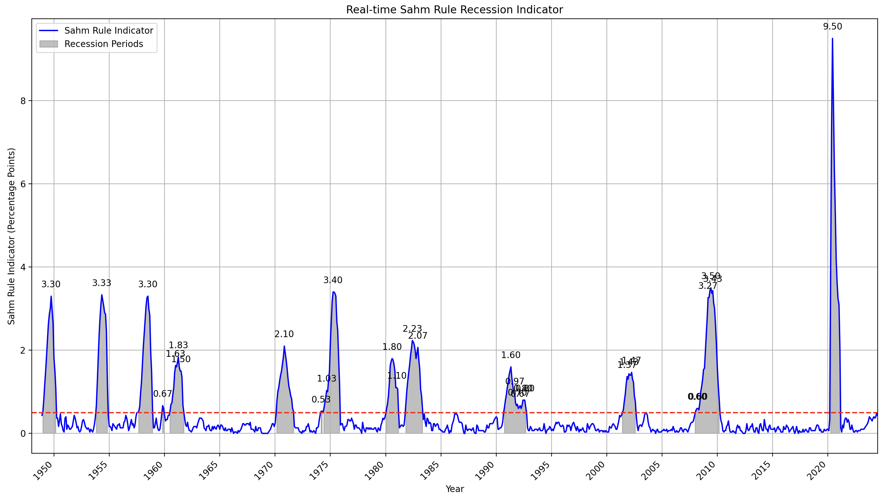

# Sahm Rule Recession Indicator

This project visualizes the Sahm Rule Recession Indicator using historical unemployment rate data from the U.S. Bureau of Labor Statistics.

## Overview

The Sahm Rule, developed by economist Claudia Sahm, is a real-time recession indicator. It signals the start of a recession when the three-month moving average of the national unemployment rate rises by 0.50 percentage points or more relative to its low during the previous 12 months.

## Features

- Calculates the Sahm Rule Indicator from unemployment rate data
- Visualizes the indicator over time
- Highlights periods when the indicator signals a recession
- Annotates peak values during recession periods

## Dependencies

- pandas
- matplotlib

## Usage

1. Ensure you have the required dependencies installed.
2. Place the 'UNRATE.csv' file in the same directory as the script.
3. Run the script to generate the visualization.

## Visualization

## Data Source

The unemployment rate data is sourced from the U.S. Bureau of Labor Statistics.
